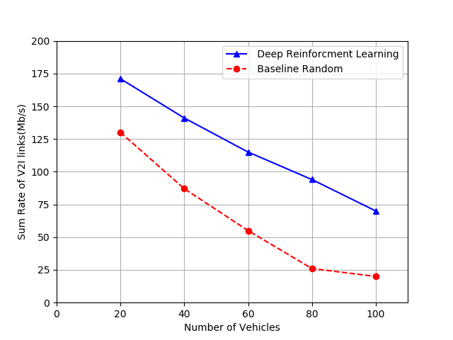
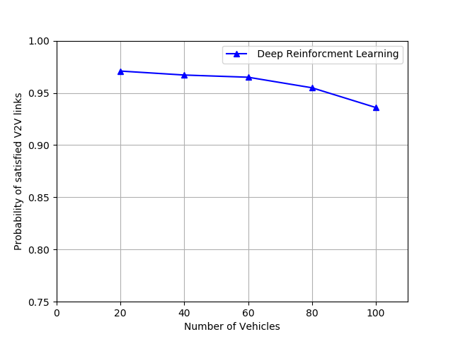
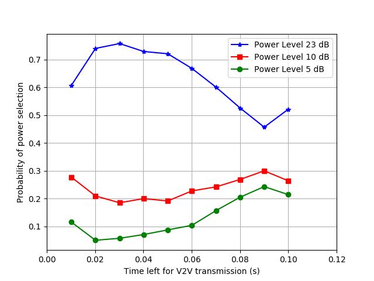
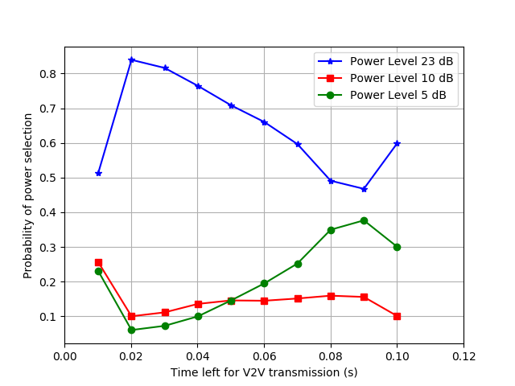

# Deep Reinforcement Learning based Resource Allocation for V2V Communications

This repository contains the implementation of `reinforcement learning` algorithm `double deep-Q learning` for resource allocation problem in the vehicle to vehicle communication based on the research paper ["Deep Reinforcement Learning based Resource Allocation for V2V Communications"](https://ieeexplore.ieee.org/document/8633948) by Hao Ye, Geoffrey Ye Li, and Biing-Hwang Fred Juang.
Orignal codes are developed by [IIT-lab, Paper-with-Code-of-Wireless-communication-Based-on-DL](https://github.com/haoyye/ResourceAllocationReinforcementLearning) which implements `deep-q learning`.

I have made some modifications in code so that the results of the research paper can be reproduced.

# Installation and use

## Linux

### Fork the repository and open the terminal using `ctrl+alt+t`
```
cd <path-to-the-python-files>

pip3 install -r requirement.txt
```

### After successful installation close the terminal and again open it, use the below command in terminal to run the program.

```
cd <path-to-the-python-files>

python3 agent.py
```
Running this code will require a good amount of time (36 hours on i7 7th gen)

## Tips and Tricks
Use the below commands to save the terminal output in .txt file. It will be beneficial while you are debugging the code.

```
python3 agent.py 2>&1 | tee SomeFile.txt
```

Run the code using the above command.

# Results reproduced using Deep-Q learning

## Sum Rate of V2I vs Number of Vehicles

|  |
|:--:|
| *Figure-1* |


> The above figure shows the sum rate of V2I vs the number of vehicles.  From the figure, we can infer that, with the increase in the number of vehicles, the number of V2V links increases as a result, the interference with the V2I link grows, therefore the V2I capacity will drop.


## Probability of Satisfied V2V links vs the number of vehicles

|  |
|:--:|
| *Figure-2* |

>The given figure shows the probability that the V2V links satisfy the latency constraint versus the number of vehicles.  From the figure, we can infer that, with the increase in the number of vehicles, the V2V links in increases, as a result, it is more difficult to ensure every vehicle satisfies the latency constraint.

##  The Probability of power level selection with the remaining time for transmission

|  |
|:--:|
| *Figure-3* |

> The above figure shows the probability for the agent to choose power levels with different time left for transmission. In general, the probability for the agent to choose the maximum power is low when there is abundant time for transmission, while the agent will select the maximum power with a high probability to ensure satisfying the V2V latency constraint when only a small amount of time left. However, when only 10 ms left, the probability for choosing the maximum power level suddenly drops to about 0.6 because the agent learns that even with the maximum power the latency constraints will be violated with high probability and switching to a lower power will get more reward by reducing interference to the V2I and other V2V links.

> Therefore, we can infer that the improvement of the deep reinforcement learning based approach comes from learning the implicit relationship between the state and the reward function.


# Effect of Double Deep-Q Learning

## The Probability of power level selection with the remaining time for transmission

|  |
|:--:|
| *Figure-4* |


> Figure-4  shows the  probability for the agent to choose power levels with different time left for transmission when  Double-Deep Q-Learning is used.   The probability for  the agent to choose the maximum power is decreased compared to the figure-3 when there is abundant time for transmission.  Also, the probability of selecting maximum power to ensure the V2V latency constraint when a small amount of time left is increased.

> Apart from this, when the agent has abundant time for transmission it will select low power transmission to reduce resource usage.
